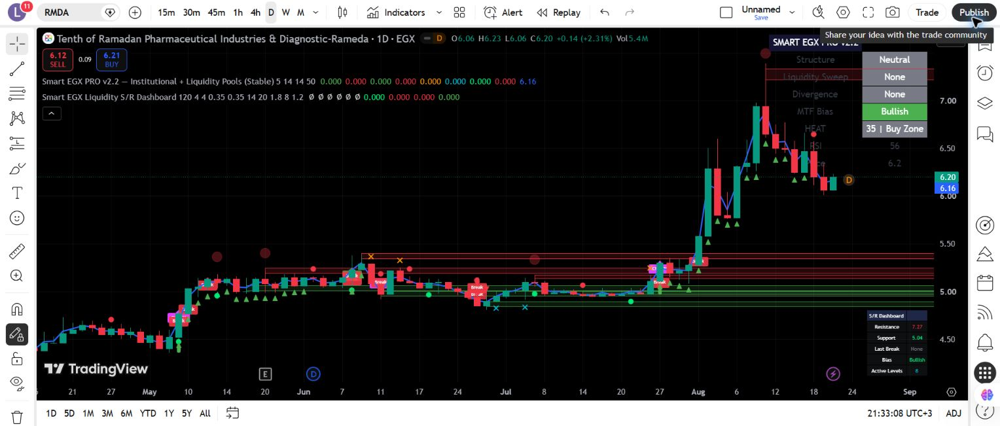
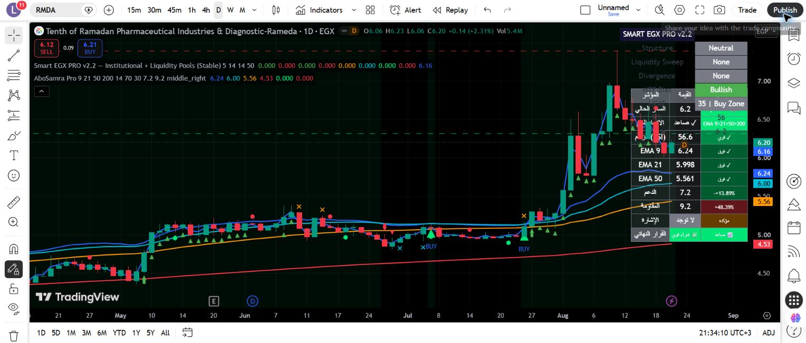
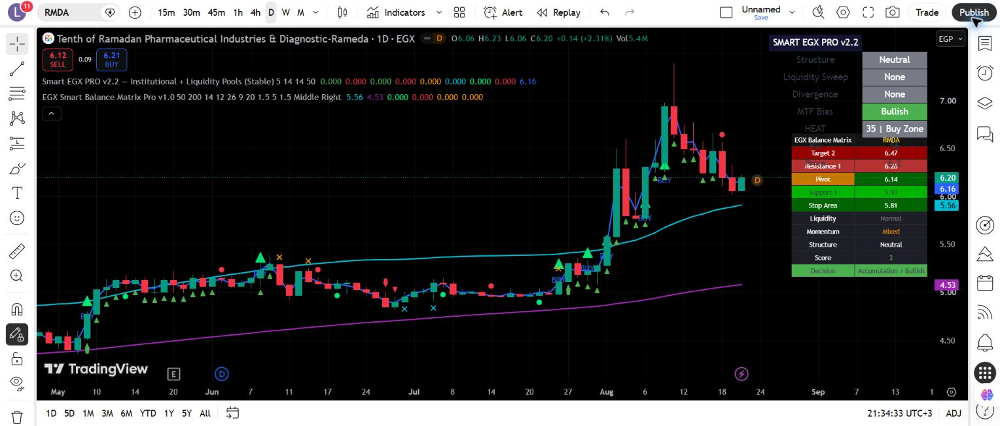
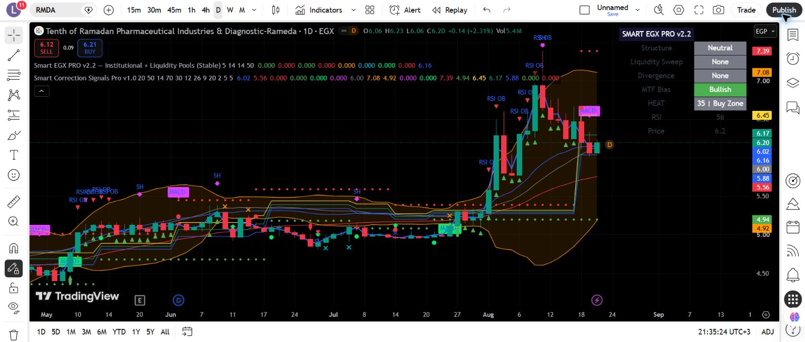
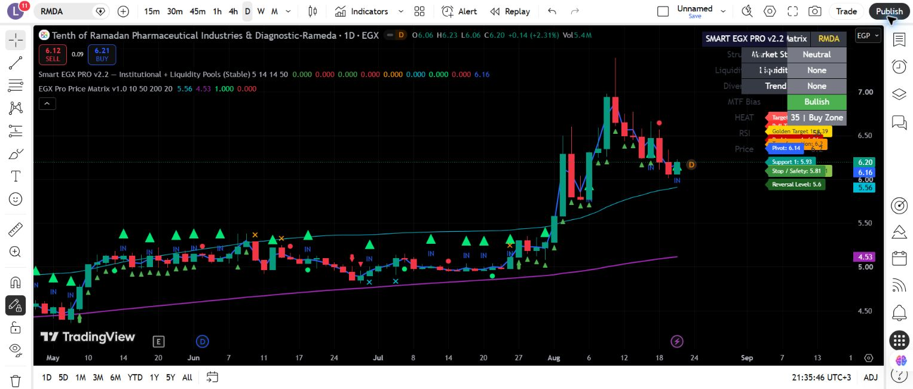

# Pine Script v6 Portfolio 📈

A curated portfolio of five Pine Script v6 indicators for Egyptian Exchange (EGX) technical analysis. This repository is intentionally small: it focuses on presentation-ready examples with compile checks, chart evidence, and documented limitations rather than serving as the full script archive.

> **Validation chart:** EGX:RMDA · 1D · screenshots captured on 2026-08-21. Market data shown by TradingView may be delayed.

## Portfolio at a glance

- **5** curated Pine Script v6 indicators
- **5 / 5** compiled successfully during portfolio validation
- **5 / 5** received a visual chart check
- Screenshots included for every portfolio item
- Repainting / confirmation behavior documented where relevant
- Technical case studies document implementation behavior without claiming trading profitability

For the larger TradingView validation project covering **120 individually tested scripts**, see [`pine-script-indicators`](https://github.com/Alaamo7/pine-script-indicators).

## Featured case studies

### Smart EGX Liquidity S/R Dashboard

A technical case study covering confirmed pivots, supply/demand zone state, BOS/CHOCH logic, liquidity-sweep heuristics, managed chart objects, dashboard rendering, alert hooks, and repainting/timing limitations.

[Read the engineering case study](docs/case-studies/smart-egx-liquidity-sr-dashboard.md)

### EGX Smart Balance Matrix Pro

A technical case study covering modular trend/momentum/liquidity engines, confirmed structure pivots, weighted scoring, threshold-cross signals, dashboard architecture, and validation limits.

[Read the engineering case study](docs/case-studies/02-egx-smart-balance-matrix-pro.md)

## Portfolio

### 1. Smart EGX Liquidity S/R Dashboard

Supply and demand zones, structure breaks, liquidity sweeps, traps, and a compact market dashboard.

[View Pine Script](indicators/01-smart-egx-liquidity-sr-dashboard.pine) · [Read Case Study](docs/case-studies/smart-egx-liquidity-sr-dashboard.md)

### 2. AboSamra Pro

A bilingual trend and momentum dashboard combining EMA 9/21/50/200, RSI, signals, and manual support/resistance context.

[View Pine Script](indicators/02-abosamra-pro.pine)

### 3. EGX Smart Balance Matrix Pro

A multi-factor EGX dashboard combining trend, momentum, liquidity, pivots, market structure, and a weighted decision score.

[View Pine Script](indicators/03-egx-smart-balance-matrix-pro.pine) · [Read Case Study](docs/case-studies/02-egx-smart-balance-matrix-pro.md)

### 4. Smart Correction Signals Pro

Correction-zone analysis using EMA, RSI, MACD, Bollinger Bands, confirmed pivots, Fibonacci levels, and configurable alerts.

[View Pine Script](indicators/04-smart-correction-signals-pro.pine)

### 5. EGX Pro Price Matrix

A daily pivot matrix with confirmed prior-day OHLC levels, trend filters, liquidity context, entry/exit signals, and a chart dashboard.

[View Pine Script](indicators/05-egx-pro-price-matrix.pine)

## Verification status

| Indicator | Pine v6 compile | Visual chart check | Repainting notes |
|---|---:|---:|---|
| Smart EGX Liquidity S/R Dashboard | Passed | Passed | Pivots are confirmed after the configured right-side bars; live-bar conditions may fluctuate until close. |
| AboSamra Pro | Passed | Passed | No higher-timeframe requests; live-bar signals may fluctuate until close. |
| EGX Smart Balance Matrix Pro | Passed | Passed | Pivot-based structure is delayed by confirmation bars; live score may update intrabar. |
| Smart Correction Signals Pro | Passed | Passed | Fibonacci anchors use confirmed pivots; current-bar setups may change before close. |
| EGX Pro Price Matrix | Passed | Passed | Daily matrix uses prior-day OHLC values; current-bar entry/exit signals may change before close. |

## Pine v6 compatibility fixes

Two source-level compatibility fixes were applied to the portfolio copies after real TradingView compilation:

- Declared `nearestSupply` and `nearestDemand` explicitly as `float` when initialized with `na`.
- Renamed the reserved identifier `range` to `swingRange`.

The underlying indicator logic was not changed.

## Usage

1. Open a script from the `indicators/` directory.
2. Copy it into the TradingView Pine Editor.
3. Click **Add to chart**.
4. Review the inputs for the target symbol and timeframe.
5. Create alerts only after confirming the intended bar-close behavior.

## Important notes

- The scripts are presented as **Beta / Active Beta** portfolio work.
- Pivot-based signals are known only after the configured confirmation bars.
- A successful compile and visual check do not guarantee trading performance.
- Test on multiple symbols, timeframes, and market conditions before any practical use.

## Related repository

[`pine-script-indicators`](https://github.com/Alaamo7/pine-script-indicators) contains the broader EGX/Pine Script toolkit, archive, documentation, and TradingView validation evidence.

## Disclaimer

This repository is for education, software demonstration, and technical research only. It is not financial advice or a recommendation to buy or sell any security. Trading involves risk, and all decisions remain the user's responsibility.

## Copyright

Copyright © 2026 Alaamo7. No license is granted for redistribution, resale, or commercial use unless the owner provides written permission.
